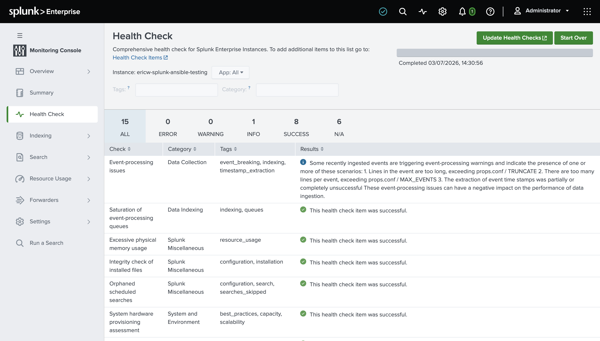
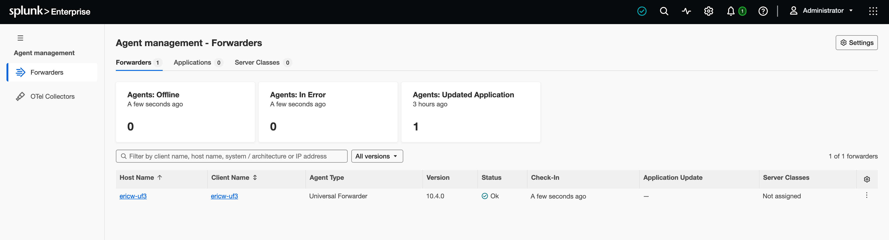

# Splunk Deploy

Automate the deployment of Splunk Enterprise and Universal Forwarders on Linux infrastructure using Ansible.

## Requirements

Install the upstream vendor collection dependencies locally before executing the playbooks:

```bash
ansible-galaxy install -r requirements.yml -p ./

```

---

## Deployment Workflows

### 1. Standalone Enterprise & Universal Forwarder Deployment

This workflow provisions Splunk Enterprise and deploys Universal Forwarder:

```bash
ansible-playbook -i inventory.yml deploy-standalone.yml

```

### 2. Distributed Infrastructure Tier Deployment

For scaled environments requiring dedicated tiering (such as Heavy Forwarders, Indexers, or Search Heads):

```bash
ansible-playbook -i inventory-distributed.ini deploy-distributed.yml

```

---

## Verification & Execution Results

A successful end-to-end run will execute without failures or unreachable endpoints:

```text
PLAY RECAP ******************************************************************************************************
ericw-splunk-ansible-testing : ok=28   changed=0    unreachable=0    failed=0    skipped=22   rescued=0    ignored=0
ericw-uf3                    : ok=59   changed=15   unreachable=0    failed=0    skipped=55   rescued=0    ignored=0

```

---

## Post-Installation Health Check

### Splunk Monitoring Console

Verify primary indexing status, operational volume metrics, and overall infrastructure health metrics directly within the Splunk Web environment:



### Agent Management/ Forwarder Management Console

Confirm that Universal Forwarder (e.g., `ericw-uf3`) have successfully phoned home to the central Splunk Enterprise instance:


